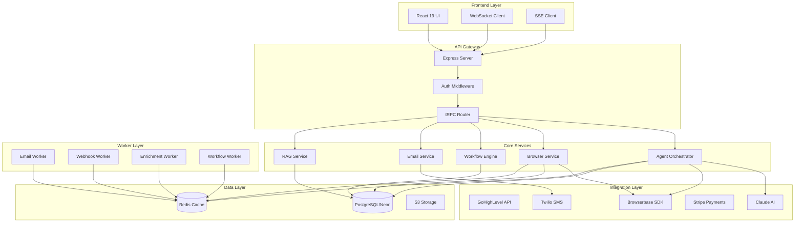
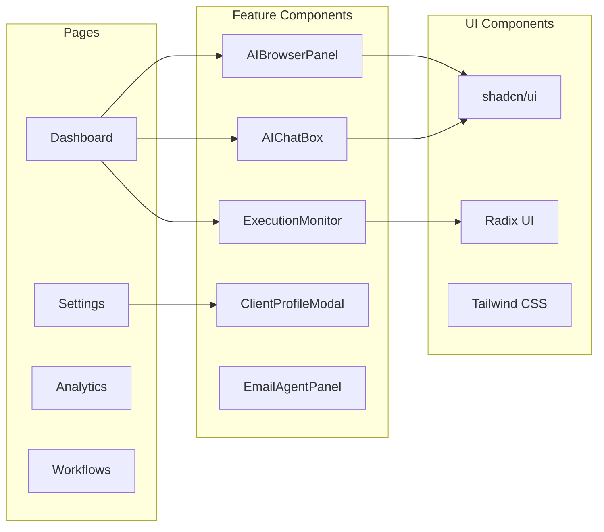
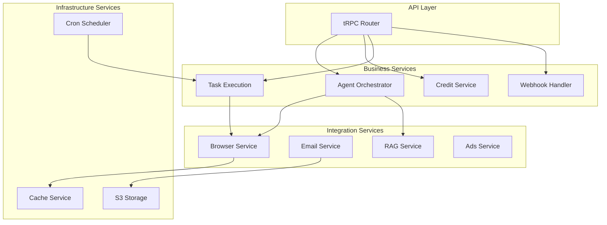
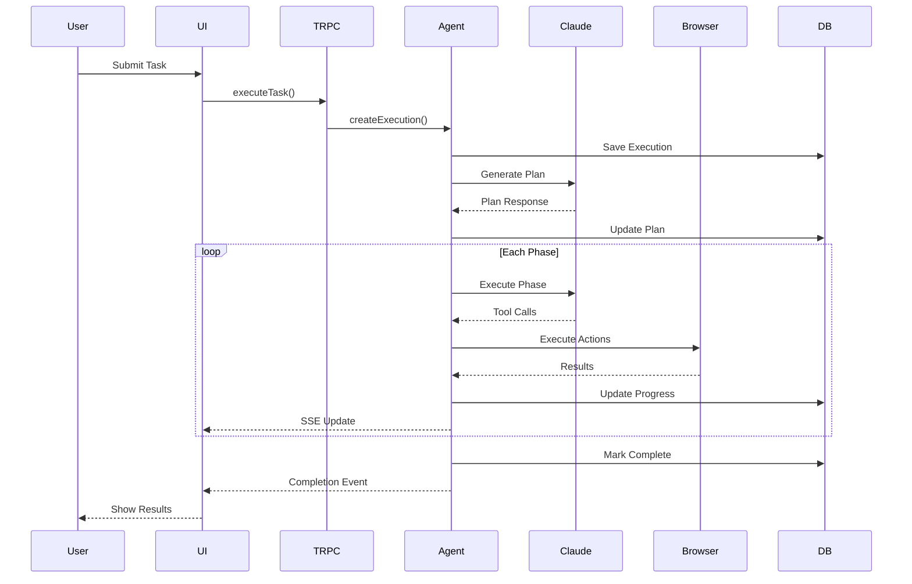
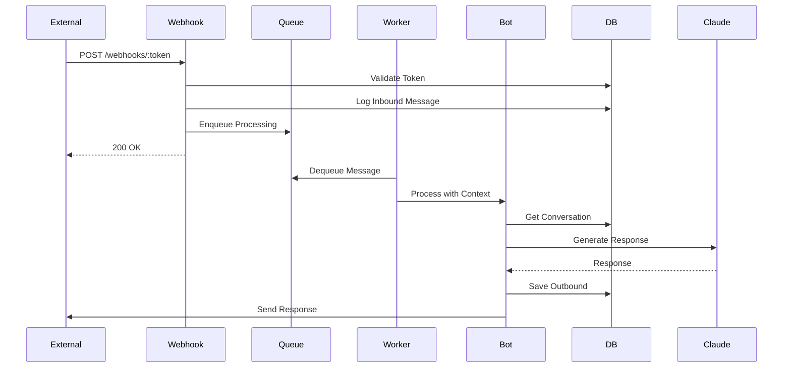
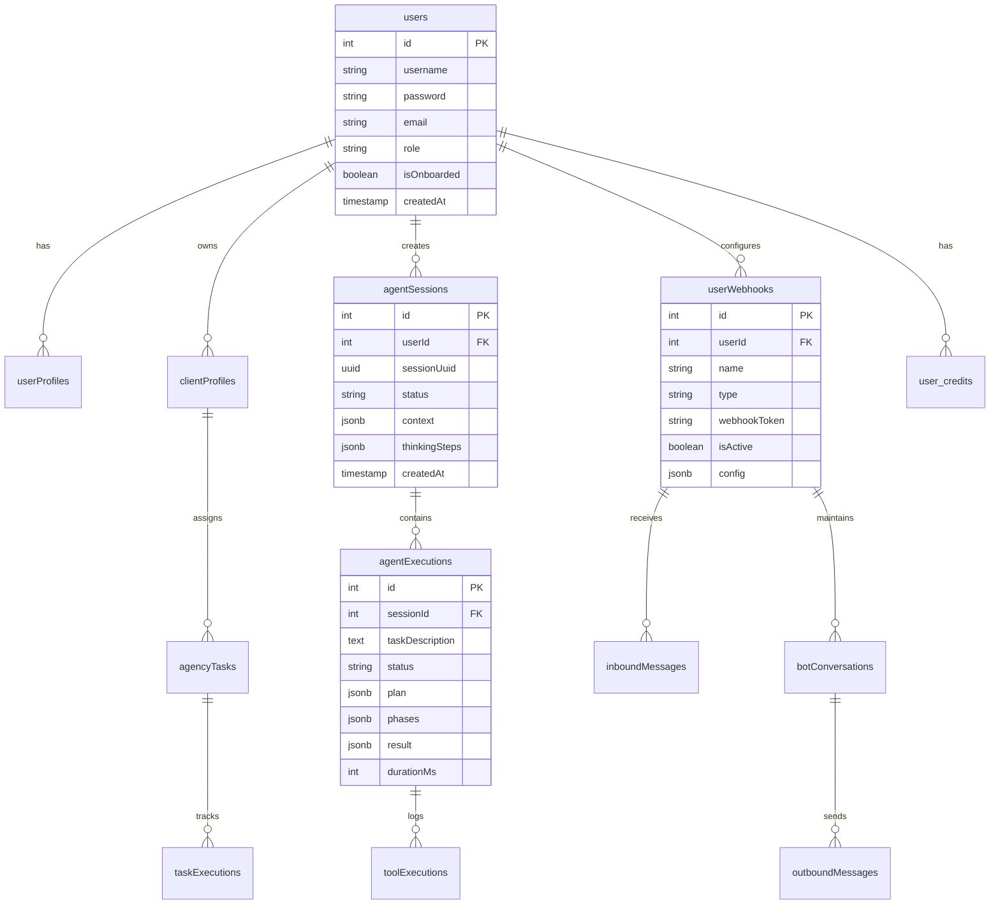
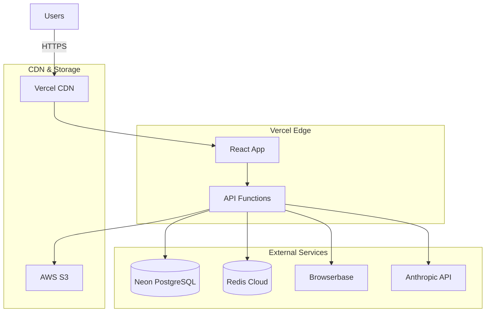
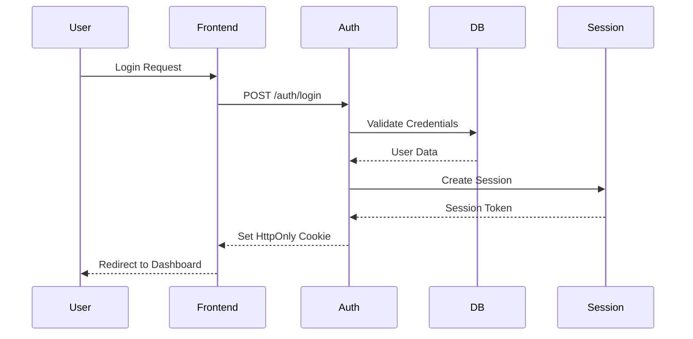

# GHL Agency AI - System Architecture

## Overview

GHL Agency AI is a white-label SaaS platform for browser automation and workflow orchestration using AI agents. It integrates with GoHighLevel (GHL) to automate client management, campaigns, workflows, and funnels through natural language commands.

## System Architecture Diagram

## Component Architecture

### Frontend Components

### Backend Services

## Data Flow Diagrams

### Agent Execution Flow

### Webhook Processing Flow

## Database Schema Overview

## Technology Stack

### Frontend
| Technology | Purpose |
|------------|---------|
| React 19 | UI Framework |
| Tailwind CSS 4 | Styling |
| shadcn/ui | Component Library |
| Radix UI | Accessible Primitives |
| tRPC Client | Type-safe API |
| Wouter | Routing |
| Zustand | State Management |
| Socket.io | Real-time Communication |

### Backend
| Technology | Purpose |
|------------|---------|
| Node.js 20 | Runtime |
| Express 4 | HTTP Server |
| tRPC 11 | API Framework |
| Drizzle ORM | Database ORM |
| BullMQ | Job Queues |
| Redis | Caching & Queues |

### Database
| Technology | Purpose |
|------------|---------|
| PostgreSQL | Primary Database |
| Neon | Serverless Postgres |
| Redis | Cache & Sessions |

### AI & Automation
| Technology | Purpose |
|------------|---------|
| Claude AI | LLM Provider |
| Browserbase | Browser Automation |
| Stagehand | AI Actions |
| OpenAI | Embeddings |

### Integrations
| Service | Purpose |
|---------|---------|
| GoHighLevel | CRM Platform |
| Stripe | Payments |
| Twilio | SMS |
| Google OAuth | Authentication |
| S3 | File Storage |

## Deployment Architecture

## Security Architecture

### Authentication Flow

### API Security Layers

1. **Authentication**: JWT tokens in HttpOnly cookies
2. **Authorization**: Role-based access control (user, admin, superadmin)
3. **Rate Limiting**: Per-user API rate limits
4. **Input Validation**: Zod schema validation on all inputs
5. **CORS**: Strict origin validation
6. **API Keys**: Optional API key authentication for external access

## Scalability Considerations

### Horizontal Scaling
- Stateless API servers
- Redis for session storage
- PostgreSQL connection pooling via Neon

### Performance Optimizations
- Redis caching for frequent queries
- Connection pooling
- Lazy loading of heavy components
- CDN for static assets

### Rate Limiting
| Resource | Limit |
|----------|-------|
| API Requests | 100/min per user |
| Browser Sessions | 3 concurrent per user |
| Webhook Calls | 1000/hour per webhook |
| AI Requests | Based on credit balance |

## Monitoring & Observability

### Metrics Collected
- API response times
- Browser session durations
- Task execution metrics
- Error rates and types
- Credit usage patterns

### Alerting
- Failed task thresholds
- Error rate spikes
- Credit depletion warnings
- Session timeout alerts

## Future Architecture Considerations

1. **Multi-Region Deployment**: Geographic distribution for latency
2. **Event Sourcing**: Full audit trail of all state changes
3. **GraphQL Gateway**: Alternative API access pattern
4. **Kubernetes**: Container orchestration for workers
5. **Message Streaming**: Kafka/Pulsar for high-volume events
