# User Flow Diagrams - Manus AI Platform

## Overview

This document contains comprehensive user flow diagrams showing how users interact with the Manus-style AI agent platform integrated with GHL Agency AI. These flowcharts visualize the complete user journey from onboarding to advanced agent orchestration.

---

## 1. Main User Journey


**Key Stages:**

1. **Authentication**: Users log in or sign up through Manus OAuth or email/password
2. **Payment**: Stripe integration handles subscription tiers (Starter, Growth, Professional, Enterprise)
3. **Onboarding**: Automated setup collects GHL credentials and client preferences
4. **Dashboard**: Central hub for all agent interactions
5. **Task Creation**: Natural language input for automation requests
6. **Execution**: Agent orchestration with real-time visualization
7. **Feedback Loop**: Users can train agents based on results

---

## 2. Agent Thinking Visualization Flow

```mermaid
flowchart TD
    UserInput[User: Create real estate funnel] --> AgentReceive[Agent Receives Task]
    
    AgentReceive --> Planning[🧠 Planning Phase]
    Planning --> ShowPlan[Display: Task Plan with 5 Phases]
    ShowPlan --> UserApprove{User Approves?}
    
    UserApprove -->|Yes| Execute[Execute Phase 1]
    UserApprove -->|No| Modify[User Modifies Plan]
    Modify --> Planning
    
    Execute --> Thinking1[💭 Show Thinking:<br/>Analyzing GHL structure...]
    Thinking1 --> Tool1[🔧 Tool Use:<br/>Browser - Navigate to GHL]
    Tool1 --> Result1[✅ Result:<br/>Successfully logged in]
    
    Result1 --> Thinking2[💭 Show Thinking:<br/>Creating landing page...]
    Thinking2 --> Tool2[🔧 Tool Use:<br/>GHL Pages API]
    Tool2 --> Result2[✅ Result:<br/>Page created]
    
    Result2 --> NextPhase{More Phases?}
    NextPhase -->|Yes| Execute
    NextPhase -->|No| Complete[✨ Task Complete]
    
    Complete --> Summary[Show Summary:<br/>- 5 phases completed<br/>- 12 tools used<br/>- 8 minutes total]
    Summary --> UserFeedback[User Provides Feedback]
    UserFeedback --> Learn[Agent Learns & Stores Knowledge]
    Learn --> End([End])
    
    style Thinking1 fill:#e1f5ff
    style Thinking2 fill:#e1f5ff
    style Tool1 fill:#fff4e1
    style Tool2 fill:#fff4e1
    style Result1 fill:#e8f5e9
    style Result2 fill:#e8f5e9
```



**Visualization Components:**

1. **Planning Phase** (Blue): Shows agent breaking down complex tasks
2. **Thinking Bubbles** (Light Blue): Real-time reasoning display
3. **Tool Usage** (Yellow): Which tools the agent is using
4. **Results** (Green): Outcome of each action
5. **Progress Indicator**: Shows current phase and overall progress
6. **Iteration Counter**: Tracks agent loop iterations

**UI Elements:**

```typescript
interface ThinkingVisualization {
  phase: string;              // "Planning" | "Executing" | "Reviewing"
  currentThought: string;     // Agent's current reasoning
  toolsUsed: ToolExecution[]; // List of tools with timestamps
  progress: number;           // 0-100%
  iterationCount: number;     // Number of agent loops
  estimatedTimeRemaining: number; // Seconds
}
```

---

## 3. Knowledge Training & Learning Flow

```mermaid
flowchart TD
    Start([Agent Completes Task]) --> Review[User Reviews Results]
    
    Review --> Feedback{Feedback Type}
    
    Feedback -->|👍 Positive| Reinforce[Reinforce Pattern]
    Feedback -->|👎 Negative| Correct[Correction Mode]
    Feedback -->|📝 Teach| Teach[Teaching Mode]
    
    Reinforce --> Store1[Store Successful Pattern]
    Store1 --> Memory[(AgentDB Memory)]
    
    Correct --> UserExplain[User Explains What Went Wrong]
    UserExplain --> AgentUnderstand[Agent: What should I have done?]
    AgentUnderstand --> UserTeach[User Provides Correct Approach]
    UserTeach --> Store2[Store Correction]
    Store2 --> Memory
    
    Teach --> KnowledgeType{Knowledge Type}
    KnowledgeType -->|Brand Voice| BrandVoice[Upload Brand Guidelines]
    KnowledgeType -->|Process| Process[Document Workflow]
    KnowledgeType -->|Preferences| Prefs[Set Preferences]
    
    BrandVoice --> Parse[Parse & Vectorize]
    Process --> Parse
    Prefs --> Parse
    Parse --> Memory
    
    Memory --> Index[Create Vector Embeddings]
    Index --> Retrieve[Retrieval System Ready]
    
    Retrieve --> NextTask[Next Task Uses Knowledge]
    NextTask --> Improved[✨ Improved Performance]
    Improved --> End([End])
    
    style Memory fill:#f3e5f5
    style Improved fill:#e8f5e9
```



**Knowledge Training Interface:**

```typescript
interface KnowledgeTraining {
  // Feedback system
  provideFeedback(executionId: string, rating: 1-5, notes: string): void;
  
  // Teaching interface
  teachPattern(context: string, correctApproach: string): void;
  
  // Knowledge upload
  uploadBrandVoice(files: File[]): void;
  uploadWorkflow(workflow: WorkflowDefinition): void;
  setPreferences(prefs: UserPreferences): void;
  
  // Knowledge retrieval
  queryKnowledge(query: string): KnowledgeResult[];
  listKnowledgeByCategory(): KnowledgeCategory[];
}
```

**Training UI Components:**

1. **Feedback Panel**: Thumbs up/down with notes
2. **Teaching Modal**: Step-by-step correction interface
3. **Knowledge Library**: Browse and manage learned knowledge
4. **Brand Voice Editor**: Upload and edit brand guidelines
5. **Workflow Builder**: Visual workflow documentation
6. **Preference Manager**: Set agent behavior preferences

---

## 4. MCP Integration & Connection Flow


**MCP Connection Manager:**

```typescript
interface MCPConnection {
  id: string;
  name: string;
  provider: string;
  status: 'connected' | 'disconnected' | 'error';
  authType: 'oauth' | 'apikey' | 'credentials';
  connectedAt: Date;
  lastUsed: Date;
  usageCount: number;
  availableTools: MCPTool[];
}

interface MCPTool {
  name: string;
  description: string;
  parameters: ToolParameter[];
  examples: string[];
}
```

**MCP Dashboard UI:**

1. **Connection Cards**: Visual cards for each MCP with status indicators
2. **Quick Connect**: One-click connection for popular services
3. **Usage Analytics**: Charts showing MCP usage over time
4. **Tool Browser**: Explore available tools from each MCP
5. **Logs Viewer**: Real-time logs of MCP tool executions
6. **Settings**: Configure permissions and rate limits

---

## 5. Task Execution Lifecycle

```mermaid
flowchart TD
    Input[User Input: Natural Language Task] --> Parse[Parse Intent]
    
    Parse --> Complexity{Task Complexity}
    
    Complexity -->|Simple| SingleAgent[Single Agent Execution]
    Complexity -->|Complex| Swarm[Multi-Agent Swarm]
    
    SingleAgent --> Plan1[Create Task Plan]
    Swarm --> Plan2[Create Swarm Plan]
    
    Plan1 --> Execute1[Execute Sequentially]
    Plan2 --> Spawn[Spawn Worker Agents]
    
    Spawn --> Execute2[Execute in Parallel]
    Execute2 --> Coordinate[Queen Agent Coordinates]
    
    Execute1 --> Loop{Agent Loop}
    Coordinate --> Loop
    
    Loop --> Think[💭 Think]
    Think --> SelectTool[🔧 Select Tool]
    SelectTool --> UseTool[Execute Tool]
    UseTool --> Observe[👁️ Observe Result]
    
    Observe --> Decision{Decision}
    Decision -->|Continue| Loop
    Decision -->|Need Help| AskUser[❓ Ask User]
    Decision -->|Complete| Done[✅ Done]
    
    AskUser --> UserResponse[User Responds]
    UserResponse --> Loop
    
    Done --> Consolidate[Consolidate Results]
    Consolidate --> Verify[Verify Quality]
    Verify --> Pass{Quality Check}
    
    Pass -->|Pass| Deliver[📦 Deliver Results]
    Pass -->|Fail| Retry[Retry with Corrections]
    Retry --> Loop
    
    Deliver --> UserReview[User Reviews]
    UserReview --> Feedback[Provide Feedback]
    Feedback --> Learn[Agent Learns]
    Learn --> End([End])
    
    style Think fill:#e1f5ff
    style SelectTool fill:#fff4e1
    style Observe fill:#e8f5e9
    style Deliver fill:#c8e6c9
```



**Execution States:**

| State | Description | UI Indicator |
|-------|-------------|--------------|
| **Planning** | Agent creating task plan | 🧠 Blue pulsing |
| **Thinking** | Agent reasoning about next action | 💭 Light blue animation |
| **Tool Use** | Executing specific tool | 🔧 Yellow with tool icon |
| **Observing** | Processing tool result | 👁️ Green with spinner |
| **Asking** | Waiting for user input | ❓ Orange with notification |
| **Complete** | Task finished | ✅ Green checkmark |
| **Error** | Something went wrong | ❌ Red with error details |

---

## 6. GHL Automation Workflow

```mermaid
flowchart TD
    Start([User: Set up real estate funnel]) --> AgentPlan[Agent Creates Plan]
    
    AgentPlan --> Phase1[Phase 1: Browser Setup]
    Phase1 --> Browserbase[Allocate Browserbase Session]
    Browserbase --> Login[Login to GHL]
    Login --> Navigate[Navigate to Funnels]
    
    Navigate --> Phase2[Phase 2: Create Landing Page]
    Phase2 --> Stagehand1[Stagehand: Create Page]
    Stagehand1 --> Template[Select Template]
    Template --> Customize[Customize with Brand]
    
    Customize --> Phase3[Phase 3: Email Sequence]
    Phase3 --> Stagehand2[Stagehand: Create Emails]
    Stagehand2 --> Email1[Welcome Email]
    Email1 --> Email2[Follow-up Email]
    Email2 --> Email3[Closing Email]
    
    Email3 --> Phase4[Phase 4: Automation]
    Phase4 --> Workflow[Create Workflow]
    Workflow --> Triggers[Set Triggers]
    Triggers --> Actions[Configure Actions]
    
    Actions --> Phase5[Phase 5: Testing]
    Phase5 --> Test[Test Funnel]
    Test --> Verify{Works?}
    
    Verify -->|Yes| Complete[✅ Complete]
    Verify -->|No| Debug[Debug Issues]
    Debug --> Fix[Apply Fixes]
    Fix --> Test
    
    Complete --> Release[Release Browser]
    Release --> Report[Generate Report]
    Report --> Notify[Notify User]
    Notify --> End([End])
    
    style Browserbase fill:#e1f5ff
    style Stagehand1 fill:#fff4e1
    style Stagehand2 fill:#fff4e1
    style Complete fill:#e8f5e9
```



**GHL Automation Components:**

1. **Browser Pool Manager**: Allocates Browserbase sessions based on tier limits
2. **Stagehand Controller**: AI-powered browser automation
3. **GHL Function Library**: 48 pre-built GHL automation functions
4. **Context Manager**: Maintains client brand voice and preferences
5. **Error Recovery**: Automatic retry with different approaches
6. **Quality Verification**: Tests funnel before marking complete

---

## 7. Authentication & Onboarding Flow


**Onboarding Steps Detail:**

### Step 1: GHL Credentials
- Collect GHL account email
- Securely store in 1Password Connect
- Verify access with test login

### Step 2: Brand Information
- Company name
- Industry/niche
- Target audience
- Brand voice (formal/casual/friendly)
- Key messaging points

### Step 3: Upload Assets
- Logo (PNG/SVG)
- Brand colors
- Fonts
- Template preferences
- Sample content

### Step 4: Set Preferences
- Automation preferences
- Notification settings
- Default templates
- Approval requirements

---

## 8. System Architecture Diagram

```mermaid
flowchart TB
    subgraph Client["🖥️ Client Layer"]
        Mobile[📱 Mobile Browser]
        Desktop[💻 Desktop Browser]
        API_Client[🔌 API Client]
    end
    
    subgraph Gateway["🚪 API Gateway"]
        Express[Express Server]
        tRPC[tRPC Router]
        WebSocket[WebSocket Server]
    end
    
    subgraph Agent["🤖 Agent Layer"]
        Orchestrator[Agent Orchestrator]
        Memory[AgentDB Memory]
        Tools[Tool Registry]
        Swarm[Swarm Coordinator]
    end
    
    subgraph GHL["🏢 GHL Automation"]
        Browserbase[Browserbase Pool]
        Stagehand[Stagehand AI]
        Functions[48 GHL Functions]
    end
    
    subgraph MCP["🔗 MCP Layer"]
        Notion[Notion MCP]
        Gmail[Gmail MCP]
        Calendar[Calendar MCP]
        Airtable[Airtable MCP]
        More[10+ More MCPs]
    end
    
    subgraph Data["💾 Data Layer"]
        Postgres[(PostgreSQL)]
        Redis[(Redis Cache)]
        S3[(S3 Storage)]
    end
    
    Client --> Gateway
    Gateway --> Agent
    Agent --> GHL
    Agent --> MCP
    Agent --> Data
    GHL --> Data
    
    style Agent fill:#e1f5ff
    style GHL fill:#fff4e1
    style MCP fill:#f3e5f5
    style Data fill:#e8f5e9
```



---

## 9. Mobile vs Desktop Experience

### Mobile Flow (Optimized for Touch)

```mermaid
flowchart TD
    Mobile[📱 Mobile User] --> Bottom[Bottom Navigation]
    
    Bottom --> Home[🏠 Home]
    Bottom --> Tasks[📋 Tasks]
    Bottom --> Knowledge[📚 Knowledge]
    Bottom --> Profile[👤 Profile]
    
    Home --> Cards[Swipeable Cards:<br/>- Active Tasks<br/>- Recent Results<br/>- Quick Actions]
    
    Tasks --> TaskList[Vertical List]
    TaskList --> Tap[Tap to Expand]
    Tap --> Details[Full Screen Details]
    Details --> Actions[Action Buttons:<br/>- View Thinking<br/>- Provide Feedback<br/>- Share]
    
    Knowledge --> Categories[Category Tabs]
    Categories --> Swipe[Swipe to Browse]
    
    Profile --> Settings[Touch-Friendly Settings]
    Settings --> Toggle[Large Toggle Switches]
    
    style Mobile fill:#e1f5ff
    style Cards fill:#fff4e1
    style Details fill:#e8f5e9
```



### Desktop Flow (Multi-Panel Layout)


---

## 10. Real-Time Updates Flow

```mermaid
sequenceDiagram
    participant User
    participant Frontend
    participant WebSocket
    participant Agent
    participant Tools
    
    User->>Frontend: Submit Task
    Frontend->>Agent: POST /api/agent/execute
    Agent->>Frontend: Return Execution ID
    Frontend->>WebSocket: Subscribe to execution:${id}
    
    Agent->>Agent: Start Planning
    Agent->>WebSocket: Emit 'phase:planning'
    WebSocket->>Frontend: Update UI: Planning Phase
    Frontend->>User: Show: 🧠 Planning...
    
    Agent->>Agent: Think about approach
    Agent->>WebSocket: Emit 'thinking' event
    WebSocket->>Frontend: Update thinking bubble
    Frontend->>User: Show: 💭 Analyzing GHL structure...
    
    Agent->>Tools: Execute Browser Tool
    Tools->>WebSocket: Emit 'tool:start'
    WebSocket->>Frontend: Update tool status
    Frontend->>User: Show: 🔧 Using Browser Tool
    
    Tools->>Tools: Perform action
    Tools->>WebSocket: Emit 'tool:progress'
    WebSocket->>Frontend: Update progress bar
    Frontend->>User: Show: Progress 45%
    
    Tools->>Agent: Return result
    Agent->>WebSocket: Emit 'tool:complete'
    WebSocket->>Frontend: Update result
    Frontend->>User: Show: ✅ Successfully logged in
    
    Agent->>Agent: Continue to next phase
    Agent->>WebSocket: Emit 'phase:advance'
    WebSocket->>Frontend: Update phase indicator
    Frontend->>User: Show: Phase 2/5
    
    Agent->>Agent: Task complete
    Agent->>WebSocket: Emit 'execution:complete'
    WebSocket->>Frontend: Show completion
    Frontend->>User: Show: ✨ Task Complete!
    
    User->>Frontend: Provide feedback
    Frontend->>Agent: POST /api/agent/feedback
    Agent->>Agent: Store in memory
    Agent->>Frontend: Acknowledge
    Frontend->>User: Show: Thank you! I learned from this.
```



---

## Summary

These flowcharts provide a complete visual guide to understanding how users interact with the Manus-style AI agent platform. The key flows include:

1. **User Journey**: From signup to advanced usage
2. **Agent Thinking**: Real-time visualization of agent reasoning
3. **Knowledge Training**: How users teach and improve agents
4. **MCP Integration**: Connecting external services
5. **Task Execution**: Complete lifecycle of agent tasks
6. **GHL Automation**: Browser-based automation workflow
7. **Authentication**: Secure onboarding process
8. **System Architecture**: Technical infrastructure overview
9. **Mobile/Desktop**: Platform-specific experiences
10. **Real-Time Updates**: WebSocket communication flow

Each flow is designed to be intuitive, transparent, and user-friendly, matching the high-quality UX of Manus AI while integrating seamlessly with your GHL Agency AI platform.

---

**Author**: Manus AI  
**Date**: December 12, 2024  
**Version**: 1.0
