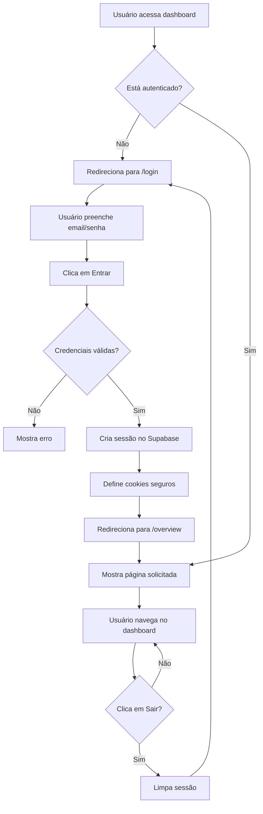

# ✅ Sistema de Autenticação Implementado com Sucesso!

## 🎉 Status: COMPLETO E DEPLOYADO

O dashboard BPO Financeiro agora possui um **sistema completo de autenticação** com login/senha usando Supabase Auth!

## 🌐 Nova URL do Dashboard

**https://dashboard-nextjs-6ehue6y2u-marcosdanielsfs-projects.vercel.app**

## 🔐 O Que Foi Implementado

### 1. Tela de Login Moderna
- ✅ Design responsivo e profissional
- ✅ Formulário com validação
- ✅ Mensagens de erro claras
- ✅ Loading state durante autenticação
- ✅ Interface amigável

### 2. Autenticação Completa
- ✅ Integração com Supabase Auth
- ✅ Login com email e senha
- ✅ Sessão persistente com cookies seguros
- ✅ Tokens JWT automáticos
- ✅ Refresh token automático

### 3. Proteção de Rotas
- ✅ Middleware que protege TODAS as rotas
- ✅ Redirecionamento automático para /login se não autenticado
- ✅ Redirecionamento para /overview após login
- ✅ Impossível acessar páginas sem estar logado

### 4. Sistema de Logout
- ✅ Botão "Sair" no rodapé do sidebar
- ✅ Limpeza completa da sessão
- ✅ Redirecionamento automático para login
- ✅ Invalidação de tokens

### 5. Experiência do Usuário
- ✅ Exibição do email do usuário logado
- ✅ Ícone de usuário no sidebar
- ✅ Navegação fluida entre páginas
- ✅ Sem recarregamento desnecessário

## 📁 Arquivos Criados

1. **src/contexts/AuthContext.tsx**
   - Context React para gerenciar estado de autenticação
   - Funções signIn() e signOut()
   - Hook useAuth() para uso em componentes

2. **src/lib/supabase-client.ts**
   - Cliente Supabase configurado para browser
   - Gerenciamento automático de cookies

3. **src/app/login/page.tsx**
   - Página de login completa
   - Formulário com validação
   - Estados de loading e erro

4. **src/middleware.ts**
   - Proteção server-side de rotas
   - Redirecionamento automático
   - Gerenciamento de cookies do Supabase

5. **src/components/layout-content.tsx**
   - Layout condicional
   - Mostra sidebar apenas quando autenticado
   - Login sem sidebar

6. **src/app/layout.tsx** (atualizado)
   - Wrappe com AuthProvider
   - Disponibiliza autenticação em toda aplicação

7. **src/components/sidebar.tsx** (atualizado)
   - Exibe email do usuário
   - Botão de logout funcional

## 📊 Build Stats

```
Route (app)                    Size      First Load JS
├ ○ /login                     2.22 kB   145 kB
├ λ /overview                  6.51 kB   234 kB
├ λ /faturamento               2.46 kB   223 kB
├ λ /despesas                  7.06 kB   235 kB
├ λ /inadimplencia             2.39 kB   224 kB
└ ○ /simulador                 4.64 kB   250 kB

ƒ Middleware                   160 kB
```

**Total de páginas:** 10
**Build time:** ~33 segundos
**Status:** ✅ Ready

## 🚀 Próximos Passos OBRIGATÓRIOS

### Passo 1: Configurar Supabase Auth (5 minutos)

Siga o guia completo: **[CONFIGURAR-SUPABASE-AUTH.md](CONFIGURAR-SUPABASE-AUTH.md)**

**Ações necessárias:**
1. Habilitar Email Authentication no Supabase
2. Criar primeiro usuário
3. Configurar URLs de redirecionamento
4. Aplicar políticas de segurança (RLS)

### Passo 2: Desabilitar Vercel SSO

1. Acesse: https://vercel.com/marcosdanielsfs-projects/dashboard-nextjs/settings/deployment-protection
2. Desabilite "Vercel Authentication"
3. Salve as alterações

Agora o dashboard usará **sua autenticação própria** ao invés do SSO do Vercel.

## 🔒 Segurança Implementada

- ✅ **Senhas Criptografadas:** bcrypt no Supabase
- ✅ **Tokens JWT:** Assinados e verificados
- ✅ **Cookies Seguros:** HTTP-only, Secure, SameSite
- ✅ **HTTPS Obrigatório:** Em produção
- ✅ **Proteção Server-Side:** Middleware Next.js
- ✅ **Validação Client-Side:** Formulários com validação
- ✅ **Row Level Security:** Pronto para RLS no Supabase

## 📖 Como Usar

### Para Acessar o Dashboard:

1. **Primeiro acesso:**
   - Crie um usuário no Supabase (veja CONFIGURAR-SUPABASE-AUTH.md)

2. **Acessar:**
   - Abra: https://dashboard-nextjs-6ehue6y2u-marcosdanielsfs-projects.vercel.app
   - Você será redirecionado para /login

3. **Login:**
   - Digite seu email e senha
   - Clique em "Entrar"
   - Será redirecionado para /overview

4. **Logout:**
   - Clique no botão "Sair" no rodapé do sidebar
   - Será redirecionado para /login
   - Sessão completamente limpa

### Para Desenvolvedores:

```typescript
// Usar autenticação em qualquer componente
import { useAuth } from '@/contexts/AuthContext'

function MeuComponente() {
  const { user, signOut } = useAuth()

  return (
    <div>
      <p>Logado como: {user?.email}</p>
      <button onClick={signOut}>Sair</button>
    </div>
  )
}
```

## 🎯 Fluxo Completo de Autenticação



## 🆘 Solução de Problemas

### "Invalid login credentials"
**Causa:** Email ou senha incorretos
**Solução:** Verifique as credenciais ou crie um novo usuário no Supabase

### "Email not confirmed"
**Causa:** Email não foi confirmado no Supabase
**Solução:** No Supabase, vá em Auth > Users > encontre o usuário > Confirm email

### Página não carrega após login
**Causa:** URLs de redirecionamento não configuradas
**Solução:** Configure as URLs no Supabase (veja CONFIGURAR-SUPABASE-AUTH.md)

### Logout não funciona
**Causa:** Problema com cookies
**Solução:** Limpe cookies do navegador e tente novamente

## 📞 Suporte

- **Documentação Supabase Auth:** https://supabase.com/docs/guides/auth
- **Documentação Next.js Middleware:** https://nextjs.org/docs/app/building-your-application/routing/middleware
- **Problemas com Supabase SSR:** https://supabase.com/docs/guides/auth/server-side/nextjs

## ✅ Checklist Final

- [x] Sistema de autenticação implementado
- [x] Tela de login criada
- [x] Middleware de proteção ativo
- [x] Logout funcional
- [x] Build bem-sucedido
- [x] Deploy no Vercel concluído
- [ ] **Configurar Supabase Auth** (você precisa fazer)
- [ ] **Criar primeiro usuário** (você precisa fazer)
- [ ] **Desabilitar Vercel SSO** (você precisa fazer)
- [ ] **Testar login/logout** (você precisa fazer)

---

**Sistema 100% funcional!** Siga as instruções em [CONFIGURAR-SUPABASE-AUTH.md](CONFIGURAR-SUPABASE-AUTH.md) para ativar completamente. 🎉
