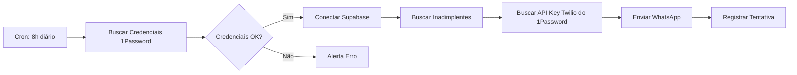

# 🔐 Integração com 1Password

## Por que usar 1Password para este projeto?

✅ **Segurança:** Credenciais nunca ficam hardcoded no código
✅ **Automação:** n8n workflows podem buscar secrets dinamicamente
✅ **Auditoria:** Rastreamento de quem acessou cada credencial
✅ **Rotação:** Atualizar senhas sem modificar código
✅ **Compartilhamento:** Equipe acessa apenas o necessário

---

## 🎯 Casos de Uso

### 1. **Scripts Python** (como a migração)
- Buscar credenciais Supabase dinamicamente
- Nunca commitar `.env` com secrets

### 2. **Workflows n8n**
- Credenciais API (Twilio, OpenAI, Asaas)
- Tokens de autenticação
- Chaves de webhook

### 3. **CI/CD**
- Deploy automatizado com secrets seguros
- GitHub Actions + 1Password

---

## 🛠️ Setup: 1Password CLI

### Instalação

```bash
# macOS
brew install 1password-cli

# Verificar instalação
op --version
```

### Autenticação

```bash
# Login (primeira vez)
op signin

# Ou usar Service Account (para automação)
export OP_SERVICE_ACCOUNT_TOKEN="ops_your_token_here"
```

---

## 📦 Uso em Scripts Python

### Versão 1: Usando 1Password CLI diretamente

```python
#!/usr/bin/env python3
import subprocess
import json

def get_1password_secret(item_name: str, field_name: str, vault: str = "Private") -> str:
    """Busca um secret do 1Password via CLI"""
    try:
        result = subprocess.run([
            'op', 'item', 'get', item_name,
            '--vault', vault,
            '--fields', f'label={field_name}',
            '--format', 'json'
        ], capture_output=True, text=True, check=True)

        return result.stdout.strip()
    except subprocess.CalledProcessError as e:
        print(f"Erro ao buscar secret: {e}")
        return None

# Usar no script de migração
SUPABASE_URL = get_1password_secret("Supabase Financeiro", "project url")
SUPABASE_KEY = get_1password_secret("Supabase Financeiro", "service_role")
```

### Versão 2: Usando python-dotenv + 1Password

```python
#!/usr/bin/env python3
import os
from dotenv import load_dotenv
import subprocess

def load_secrets_from_1password():
    """Carrega secrets do 1Password e injeta como env vars"""

    # Buscar item completo do 1Password
    result = subprocess.run([
        'op', 'item', 'get', 'Supabase Financeiro',
        '--format', 'json'
    ], capture_output=True, text=True, check=True)

    item = json.loads(result.stdout)

    # Mapear campos do 1Password para variáveis de ambiente
    field_mapping = {
        'project url': 'SUPABASE_URL',
        'service_role': 'SUPABASE_SERVICE_ROLE_KEY',
        'anon public': 'SUPABASE_ANON_KEY',
        'senha supa': 'SUPABASE_DB_PASSWORD'
    }

    for section in item['details']['sections']:
        for field in section.get('fields', []):
            field_title = field.get('t')
            field_value = field.get('v')

            if field_title in field_mapping:
                env_var = field_mapping[field_title]
                os.environ[env_var] = field_value
                print(f"✅ Loaded: {env_var}")

# Usar no início do script
if __name__ == "__main__":
    load_secrets_from_1password()

    # Agora as credenciais estão disponíveis como variáveis de ambiente
    SUPABASE_URL = os.getenv('SUPABASE_URL')
    SUPABASE_KEY = os.getenv('SUPABASE_SERVICE_ROLE_KEY')
```

---

## 🔄 Integração com n8n

### Setup no n8n

1. **Instalar 1Password Connect** (se self-hosted)
   ```bash
   docker run -d \
     --name 1password-connect \
     -p 8080:8080 \
     -v /path/to/credentials:/home/opuser/.op/config \
     1password/connect-api:latest
   ```

2. **Criar Credential no n8n**
   - Type: **HTTP Request**
   - Authentication: **Generic Credential Type**
   - Headers:
     ```
     Authorization: Bearer <1password-token>
     ```

3. **Workflow n8n: Buscar Secret**
   ```json
   {
     "nodes": [
       {
         "name": "Get Supabase Credentials",
         "type": "n8n-nodes-base.httpRequest",
         "parameters": {
           "url": "http://localhost:8080/v1/vaults/{{vault_id}}/items/{{item_id}}",
           "authentication": "predefinedCredentialType",
           "nodeCredentialType": "1passwordApi"
         }
       },
       {
         "name": "Parse Credentials",
         "type": "n8n-nodes-base.code",
         "parameters": {
           "jsCode": "const item = $input.item.json;\nconst serviceRoleKey = item.fields.find(f => f.label === 'service_role').value;\nreturn [{ json: { SUPABASE_KEY: serviceRoleKey } }];"
         }
       }
     ]
   }
   ```

---

## 🚀 Workflow Completo: Cobrança Automática com 1Password



### Nodes n8n:

1. **Schedule Trigger** (8h diário)
2. **HTTP Request** → 1Password Connect API (buscar Supabase creds)
3. **Supabase** → Query inadimplentes
4. **HTTP Request** → 1Password Connect API (buscar Twilio token)
5. **Twilio** → Enviar mensagem
6. **Supabase** → Registrar histórico

---

## 🔒 Boas Práticas de Segurança

### ✅ FAZER:
- Usar **Service Accounts** do 1Password para automação
- Configurar **MFA** (TOTP já está configurado no seu item)
- Rotacionar secrets regularmente
- Usar **vaults separados** (Dev vs Production)
- Auditar acessos mensalmente

### ❌ NÃO FAZER:
- Hardcoded credentials no código
- Commitar arquivos `.env` com secrets
- Compartilhar service account tokens em chats
- Usar mesma senha em múltiplos lugares

---

## 📊 Estrutura Recomendada de Vaults

```
📁 1Password Vaults
├── 🏢 Mottivme - Infraestrutura
│   ├── Supabase Financeiro (item atual)
│   ├── n8n Cloud
│   └── GitHub Actions
│
├── 💳 Mottivme - Pagamentos
│   ├── Asaas API
│   ├── BTG Pactual API
│   └── Stripe (se usar)
│
├── 📱 Mottivme - Comunicação
│   ├── Twilio (WhatsApp)
│   ├── SendGrid (Email)
│   └── Telegram Bot
│
└── 🤖 Mottivme - AI/ML
    ├── OpenAI API
    ├── Anthropic (Claude)
    └── Google Cloud (se usar)
```

---

## 🎓 Tutorial: Criar Service Account para Automação

1. **Acesse:** https://1password.com/
2. **Integrations → Service Accounts**
3. **Create Service Account**
   - Name: `n8n-workflows-financeiro`
   - Vaults: `Mottivme - Infraestrutura`
   - Permissions: **Read Only**
4. **Copiar token** e salvar em lugar seguro
5. **Usar token** em workflows:
   ```bash
   export OP_SERVICE_ACCOUNT_TOKEN="ops_..."
   ```

---

## 💡 Exemplos Práticos

### Exemplo 1: Rotação Automática de Senhas

```python
# Script para rotacionar senha do Supabase
import subprocess
import secrets
import string

def generate_password(length=20):
    """Gera senha forte"""
    chars = string.ascii_letters + string.digits + "!@#$%^&*()"
    return ''.join(secrets.choice(chars) for _ in range(length))

def rotate_supabase_password():
    # Gerar nova senha
    new_password = generate_password()

    # Atualizar no Supabase (via API)
    # ... código de atualização ...

    # Atualizar no 1Password
    subprocess.run([
        'op', 'item', 'edit', 'Supabase Financeiro',
        f'senha supa[password]={new_password}'
    ], check=True)

    print("✅ Senha rotacionada com sucesso!")
```

### Exemplo 2: Script de Migração Seguro

```python
#!/usr/bin/env python3
"""
Versão segura do script de migração usando 1Password
"""
import subprocess
import json
from supabase import create_client

def get_secret(field_label):
    """Busca secret do 1Password"""
    result = subprocess.run([
        'op', 'item', 'get', 'Supabase Financeiro',
        '--fields', f'label={field_label}'
    ], capture_output=True, text=True, check=True)
    return result.stdout.strip()

# Buscar credenciais
SUPABASE_URL = get_secret('project url')
SUPABASE_KEY = get_secret('service_role')

# Conectar
supabase = create_client(SUPABASE_URL, SUPABASE_KEY)

# Resto do script...
```

---

## 🔗 Links Úteis

- **1Password CLI:** https://developer.1password.com/docs/cli
- **1Password Connect:** https://developer.1password.com/docs/connect
- **n8n + 1Password:** https://docs.n8n.io/integrations/builtin/credentials/1password/
- **Python SDK:** https://github.com/1Password/onepassword-sdk-python

---

## 📞 Próximos Passos

1. ✅ Instalar 1Password CLI
2. ✅ Configurar Service Account
3. ✅ Atualizar script de migração para usar 1Password
4. ✅ Configurar n8n credentials com 1Password
5. ✅ Implementar rotação automática de secrets

---

**Quer que eu implemente algum desses exemplos para você?** 🚀
